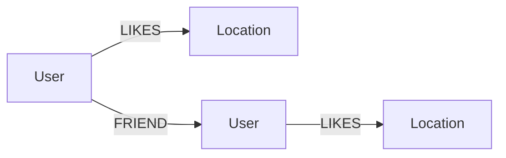

# Photography Location Recommender System

ระบบแนะนำสถานที่ถ่ายรูปด้วย **Neo4j Aura + Streamlit + Cypher** โดยปรับจากเนื้อหาใน Colab `Photography_Practice_Neo4j_UserRelations_Graph.ipynb` ที่แนบมา

## 1. แนวคิดของระบบ

ระบบใช้ Property Graph สำหรับเก็บความสัมพันธ์ระหว่างผู้ใช้และสถานที่ถ่ายรูป

```text
(User)-[:LIKES]->(Location)
(User)-[:FRIEND]-(User)
```

ข้อมูลตัวอย่างตาม Colab ประกอบด้วย

- User 10 คน
- Photography Location 10 แห่ง
- `LIKES` 22 ความสัมพันธ์ตามรายการข้อมูลจริงใน Colab
- `FRIEND` 12 ความสัมพันธ์

ระบบแนะนำสถานที่โดยเดินกราฟตามแนวคิด:

```text
User
  ↓ LIKES
สถานที่ที่ชอบร่วมกัน
  ↓
User ที่มีความชอบร่วมกัน
  ↓ LIKES
สถานที่ใหม่ที่ User เป้าหมายยังไม่ชอบ
```

จากนั้นนับจำนวนเส้นทางที่นำไปยังสถานที่เดียวกันเป็น `score`

## 2. Graph Data Model



### Node

| Label | Property | หน้าที่ |
|---|---|---|
| `User` | `name` | ผู้ใช้งานระบบ |
| `Location` | `name` | สถานที่ถ่ายรูป |

### Relationship

| Relationship | Direction | ความหมาย |
|---|---|---|
| `LIKES` | User → Location | User ชอบสถานที่ |
| `FRIEND` | User — User | ความสัมพันธ์ระหว่าง User |

## 3. Recommendation Algorithm

Query หลักยึดตาม Colab:

```cypher
MATCH (target:User {name: $target_user})-[:LIKES]->(liked:Location)
MATCH (similar:User)-[:LIKES]->(liked)
WHERE similar <> target
MATCH (similar)-[:LIKES]->(recommended:Location)
WHERE NOT (target)-[:LIKES]->(recommended)
RETURN recommended.name AS location, count(*) AS score
ORDER BY score DESC, location ASC
```

ความหมายคือ

1. หา Location ที่ User เป้าหมายชอบ
2. หา User คนอื่นที่ชอบ Location เดียวกัน
3. ดู Location อื่นที่ User เหล่านั้นชอบ
4. ตัด Location ที่ User เป้าหมายชอบอยู่แล้ว
5. นับจำนวนเส้นทางเพื่อเป็นคะแนน
6. เรียงคะแนนจากมากไปน้อย

นี่เป็น recommendation แบบ graph traversal ที่ใช้ข้อมูลความชอบร่วมกัน ไม่ใช่ Machine Learning model

## 4. หน้าใน Streamlit

- **Dashboard** — จำนวน User, Location, LIKES และ FRIEND พร้อมข้อมูลของ User
- **Recommendations** — เลือก User และดูสถานที่ที่ระบบแนะนำ
- **User & Location** — ดูสถานที่ที่ชอบ เพื่อน และ User ที่มีความชอบร่วมกัน
- **Graph Explorer** — ดูตารางและกราฟ User → Location / User → User / Neighborhood
- **Cypher Examples** — ตัวอย่าง Query จาก Colab
- **Admin / Setup** — สร้าง Constraint และข้อมูลตัวอย่าง

## 5. โครงสร้างโปรเจกต์

```text
GrapDB1-main/
├── app.py
├── neo4j_service.py
├── requirements.txt
├── README.md
├── .gitignore
├── .gitattributes
├── .streamlit/
│   └── secrets.toml.example
├── cypher/
│   ├── schema.cypher
│   └── recommendation.cypher
├── docs/
│   └── PROJECT_GUIDE_TH.md
├── colab/
│   └── Photography_Practice_Neo4j_UserRelations_Graph.ipynb
└── kairung99.jpg
```

## 6. การตั้งค่า Neo4j Aura

สร้าง `.streamlit/secrets.toml` จากไฟล์ตัวอย่าง แล้วใส่ค่าของ Neo4j Aura:

```toml
[neo4j]
uri = "neo4j+s://YOUR_INSTANCE.databases.neo4j.io"
username = "neo4j"
password = "YOUR_PASSWORD"
database = "neo4j"
```

**อย่า commit `secrets.toml` ขึ้น GitHub**

## 7. การติดตั้งและรัน

```bash
python -m venv .venv
```

Windows:

```bash
.venv\Scripts\activate
```

ติดตั้ง package:

```bash
pip install -r requirements.txt
```

รัน:

```bash
streamlit run app.py
```

ครั้งแรกให้เข้า **Admin / Setup → สร้างข้อมูลตัวอย่างจาก Colab**

ระบบใช้ `MERGE` ดังนั้นสามารถ seed ข้อมูลซ้ำได้โดยไม่สร้าง User, Location และ Relationship เดิมซ้ำ

## 8. Colab

ไฟล์ Colab ที่ใช้เป็นต้นทางของเนื้อหาอยู่ใน:

```text
colab/Photography_Practice_Neo4j_UserRelations_Graph.ipynb
```

โปรเจกต์นี้เปลี่ยนจาก GraphBook เดิมให้ใช้ schema และ recommendation logic ตาม Colab ดังกล่าว

> หมายเหตุ: Cell แรกของ Colab ระบุว่า “ความชอบ 21 รายการ” แต่รายการ `likes` ที่กำหนดจริงมี 22 คู่ ระบบนี้จึงยึดข้อมูล 22 คู่ตามรายการจริงและไม่ได้ตัดข้อมูลออก
