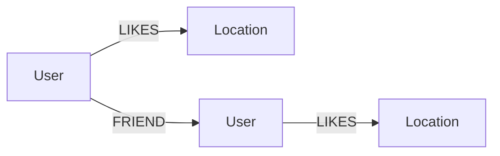

# คู่มือโครงงาน Photography Location Recommender

## 1. เป้าหมาย

ระบบนี้นำเนื้อหาจาก Colab `Photography_Practice_Neo4j_UserRelations_Graph.ipynb` มาพัฒนาเป็น Web Application ด้วย Streamlit และ Neo4j Aura

ผู้เรียนจะได้ฝึก:

1. สร้าง Property Graph
2. สร้าง Node และ Relationship
3. ใช้ `MERGE` และ Constraint
4. เขียน Cypher ด้วย `MATCH`, `WHERE`, `RETURN`, `ORDER BY`, `UNWIND`
5. ทำ Graph Traversal
6. สร้าง Recommendation จากความชอบร่วมกัน
7. เชื่อม Python กับ Neo4j ด้วย Neo4j Driver
8. แสดงผลผ่าน Streamlit

## 2. ข้อมูลจาก Colab

ข้อมูลตัวอย่างถูกคงตาม Colab:

### User

`Pim`, `Beam`, `Mew`, `Film`, `Nina`, `Earth`, `Praew`, `Win`, `View`, `Mark`

### Location

`ICONSIAM`, `Talad Noi`, `Asiatique The Riverfront`, `Benjakitti Park`, `Chatuchak Weekend Market`, `The Commons Thonglor`, `Wat Arun`, `Yaowarat`, `Bangkok Art and Culture Centre`, `Ancient City`

### Relationships

`LIKES` มี 22 รายการตามรายการข้อมูลจริงใน Colab และ `FRIEND` มี 12 รายการ

## 3. Graph Model



### User

เก็บชื่อผู้ใช้ด้วย property:

```text
name
```

### Location

เก็บชื่อสถานที่ด้วย property:

```text
name
```

### LIKES

แสดงว่า User ชอบ Location:

```text
(User)-[:LIKES]->(Location)
```

### FRIEND

แสดงความสัมพันธ์ระหว่าง User:

```text
(User)-[:FRIEND]-(User)
```

ในการ query ใช้ `-[:FRIEND]-` เพื่อมองความสัมพันธ์เพื่อนโดยไม่สนทิศทาง

## 4. Constraint

```cypher
CREATE CONSTRAINT user_name_unique IF NOT EXISTS
FOR (u:User) REQUIRE u.name IS UNIQUE;

CREATE CONSTRAINT location_name_unique IF NOT EXISTS
FOR (l:Location) REQUIRE l.name IS UNIQUE;
```

Constraint ช่วยให้ชื่อ User และ Location ไม่ซ้ำกัน

## 5. Seed Data

ระบบใช้ `UNWIND + MERGE`

ตัวอย่าง:

```cypher
UNWIND $names AS name
MERGE (:User {name:name})
```

ข้อดีคือสามารถกดสร้างข้อมูลตัวอย่างซ้ำได้โดยไม่เพิ่ม Node เดิมซ้ำ

## 6. Basic Queries

### ดูจำนวน User และ Location

```cypher
MATCH (u:User)
RETURN count(u) AS users;

MATCH (l:Location)
RETURN count(l) AS locations;
```

### ดูสถานที่ที่ Pim ชอบ

```cypher
MATCH (:User {name: $name})-[:LIKES]->(l:Location)
RETURN l.name AS location
ORDER BY location;
```

### ดู User ที่มีความชอบร่วมกับ Pim

```cypher
MATCH (:User {name: $name})-[:LIKES]->(l:Location)<-[:LIKES]-(other:User)
WHERE other.name <> $name
RETURN l.name AS location, collect(other.name) AS similar_users
ORDER BY location;
```

### ดูเพื่อนและสถานที่ที่เพื่อนชอบ

```cypher
MATCH (u:User)-[:FRIEND]-(friend:User)-[:LIKES]->(l:Location)
WHERE NOT (u)-[:LIKES]->(l)
RETURN u.name AS user,
       friend.name AS friend,
       l.name AS location
ORDER BY user, friend, location;
```

## 7. Recommendation

ระบบแนะนำสถานที่ตาม Query ใน Colab:

```cypher
MATCH (target:User {name: $target_user})-[:LIKES]->(liked:Location)
MATCH (similar:User)-[:LIKES]->(liked)
WHERE similar <> target
MATCH (similar)-[:LIKES]->(recommended:Location)
WHERE NOT (target)-[:LIKES]->(recommended)
RETURN recommended.name AS location, count(*) AS score
ORDER BY score DESC, location ASC;
```

### ตัวอย่างการคำนวณ

ถ้า User เป้าหมายชอบ Location A และ User คนอื่นก็ชอบ A เหมือนกัน ระบบจะพิจารณา Location อื่นที่ User คนนั้นชอบ

ถ้าหลายเส้นทางนำไปยัง Location เดียวกัน:

```text
Location X → score 3
Location Y → score 1
```

Location X มีจำนวนเส้นทางมากกว่าในข้อมูลที่ใช้ จึงถูกจัดลำดับก่อนตาม Query

ระบบไม่ได้กำหนด weight เพิ่มเติม และไม่ได้ใช้ Machine Learning

## 8. การสร้าง Graph Visualization

Colab ใช้ `NetworkX` และ `Matplotlib` เพื่อวาดกราฟ

ตัวอย่างแนวคิด:

```python
G = nx.Graph()
G.add_node(user)
G.add_node(location)
G.add_edge(user, location)
```

ใน Streamlit มีหน้า Graph Explorer สำหรับแสดงข้อมูลความสัมพันธ์และวาดกราฟในรูปแบบเดียวกัน

## 9. โครงสร้างโปรแกรม

```text
Streamlit UI
     ↓
neo4j_service.py
     ↓
Neo4j Aura
```

`app.py` รับผิดชอบ UI

`neo4j_service.py` รับผิดชอบ:

- Connection
- Constraint
- Seed data
- Query
- Recommendation
- Graph data

## 10. ความปลอดภัยของ Credential

ไม่ใส่ password ลงใน source code

ใช้:

```text
.streamlit/secrets.toml
```

และเก็บไฟล์นี้ไว้ใน `.gitignore`

## 11. ลำดับการทดลอง

1. เปิด Neo4j Aura
2. สร้าง `.streamlit/secrets.toml`
3. ติดตั้ง requirements
4. รัน Streamlit
5. เข้า Admin / Setup
6. สร้าง Constraint
7. สร้างข้อมูลตัวอย่างจาก Colab
8. เปิด Dashboard
9. ทดลอง Recommendations
10. เปิด Graph Explorer
11. ทดลอง Cypher Examples
12. เปรียบเทียบผลกับ Query ใน Colab

## 12. ไฟล์ต้นทาง

ไฟล์ Colab ที่ใช้เป็นเนื้อหาหลักของระบบถูกเก็บไว้ใน:

```text
colab/Photography_Practice_Neo4j_UserRelations_Graph.ipynb
```

ดังนั้นสามารถเปิดดูขั้นตอนเดิมทั้งหมดได้ ตั้งแต่การเชื่อมต่อ Neo4j, สร้าง Node, สร้าง Relationship, Query, Visualization และ Recommendation

## 13. หมายเหตุเรื่องจำนวน LIKES ใน Colab

ใน Cell แรกของ Colab ระบุว่า User 10 คน, Location 10 แห่ง และความชอบ 21 รายการ แต่รายการ `likes` ใน Cell 20 มีข้อมูลจริง 22 คู่ ระบบนี้ยึดรายการข้อมูลจริงทั้ง 22 คู่ เพื่อไม่ตัดข้อมูลออกโดยไม่มีเหตุผล
